## Prof. Simon Myers

Our group is based jointly at the [Department of Statistics](https://www.stats.ox.ac.uk), and the [Wellcome Trust Centre for Human Genetics](https://www.well.ox.ac.uk). We are broadly interested in answering questions in statistical, population, and medical genetics. We develop and apply model-based computational techniques, and perform lab-based research. One strong focus of the group’s research is the study of the basic biological process of recombination, and its links to fertility and health in mammals. A second focus is inference of  fine-scale population structure – within individual countries – and the genetic impacts of migration events, in humans and other species.

[CV](http://www.stats.ox.ac.uk/~myers/CV.docx) - 
[ORCID Profile](http://orcid.org/0000-0002-2585-9626) - 
[myers@stats.ox.ac.uk](mailto:myers@stats.ox.ac.uk)

## Dr Emmanuelle Bitoun

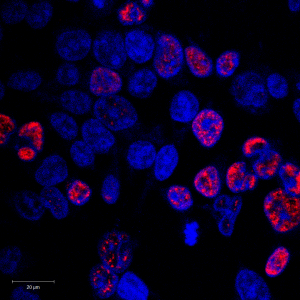

I am a postdoc performing experimental lab-based research to study recombination, and its links to speciation, in mammals. I leverage a variety of experimental techniques including ChIP-Seq, fertility assays, transfection, and the investigation of protein-protein interactions.

[ebitoun@well.ox.ac.uk](mailto:ebitoun@well.ox.ac.uk)

## [Dr Christopher C. Gill](http://www.stats.ox.ac.uk/~gill/)

I am working with the ancestry company [LivingDNA](https://www.livingdna.com/). This is part of the Systems Approaches to Biomedical Sciences ([SABS](http://www.sabsidc.ox.ac.uk/)) doctoral program. I am currently interested in developing statistical tools and pipelines to provide new insights into genetic ancestry estimation.

Having completed my degree in 2006, covering a wide range of mathematical topics, I went on to complete a DPhil, focussing on the representation theory of finite groups. Much of my time was spent studying questions related to the decomposition numbers. More specifically, I studied properties of Young modules, an important aspect of the representation theory of the symmetric group, and more generally trivial source modules for finite groups. I spent several years pursuing research in this area, whilst enjoying a considerable amount of teaching. I held positions at Charles University in Prague, and at Somerville College and Keble College in Oxford. In 2015 I decided to pursue a more interdisciplinary approach to research in the biological/biomedical setting.

[gill@stats.ox.ac.uk](mailto:gill@stats.ox.ac.uk)

## Sinan Shi

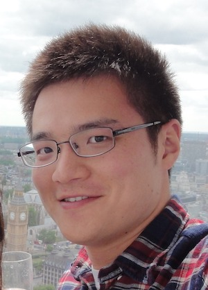

I am a DPhil student co-supervised by Prof. Simon Myers and Prof. Pier Palamara, working on the phasing and imputation of 100,000 Genomes Project of Genomics England. Previously, I worked as a research software engineer in various research institutes.

[sinan.shi@stats.ox.ac.uk](mailto:sinan.shi@stats.ox.ac.uk)

## Miriam Stricker

I am a DPhil student co-supervised by Prof. Pier Palamara (Systems Approaches to Biomedical Sciences CDT, collaboration with Satu Nahkuri, Roche). My current research is focused on developing machine learning algorithms to study how variation in non-coding parts of the genome influences the epigenetics and expression levels of coding parts of the genome, with applications within cancer immunotherapies. Before joining the lab I worked in Biophysics and obtained degrees from Heidelberg University. 

[miriam.stricker@wolfson.ox.ac.uk](mailto:miriam.stricker@wolfson.ox.ac.uk)

## Luis Torada Aguilella

I am a DPhil student co-supervised by Robert Davies and Simon Myers at Oxford, as well as Satu Nahkuri and Tony Kam-Thong at Roche. I am currently investigating genetic heterogeneity within Autism Spectrum Disorder. Before coming to Oxford, I did a BSc in Biochemistry at University of Navarra (Spain) and a MSc in Bioinformatics and Systems Biology at Imperial College London (UK). I then joined the Systems Approaches to Biomedical Science Doctoral Training Center (SABS DTC) at Oxford, starting my DPhil in Nov 2019. My current project reflects my major research interest: large-scale dataset modelling with health impact.

[luis.torada@linacre.ox.ac.uk](mailto:luis.torada@linacre.ox.ac.uk)

## Lino Ferreira

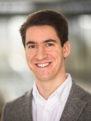

I am a DPhil student in the Genomic Medicine and Statistics programme. My research focuses on the portability of GWAS associations and polygenic risk score performance across populations. Prior to starting my DPhil, I completed an MSc in statistics at the University of Edinburgh.

[lino.ferreira@well.ox.ac.uk](mailto:lino.ferreira@well.ox.ac.uk)

## Alumni

## [Dr Leo Speidel](https://leospeidel.com/)

Dr Leo Speidel completed a DPhil and postdoc (2016-2020) working on a method for estimating genealogies for thousands of DNA samples. The method, Relate, is available at [https://myersgroup.github.io/relate/](https://myersgroup.github.io/relate/).

## [Dr Sile Hu](http://users.ox.ac.uk/~stat0311/)

Dr Sile Hu completed a postdoc working on the project “Building a platform for genetic inference from the Genomics England data”. He is now a Research Scientist at the Novo Nordisk Research Centre in Oxford.

## [Dr Daniel Wells](http://www.danielwells.me)

Dr Daniel Wells completed a DPhil investigating patterns of gene expression in meiosis. He is now a Precision Health Scientist at Genomics plc.

## Yunli Song

Yunli Song worked on the detection and genotyping of variable minisatellites from high-throughput sequencing data.

## [Dr Zhangyi He](https://uk.linkedin.com/in/zhangyi-he)

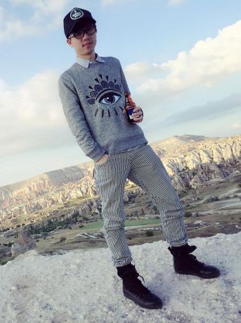

Dr Zhangyi He completed a postdoc working on the Wellcome Trust-funded project “Building a platform for genetic inference from the Genomics England data”. He is now a Research Associate in Data Science at Imperial College London.

## [Dr Clare Bycroft](https://twitter.com/bycgen):

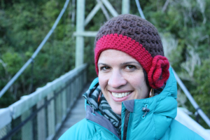

Dr Clare Bycroft completed a DPhil on the inference of demographic history from patterns of genetic variation. She is now a Scientist at Genomics plc.

## [Dr Ran Li](https://www.stats.ox.ac.uk/people/research_staff/ran_li)

Dr Ran Li completed a postdoc working on the resolution of recombination. She is now a postdoctoral researcher in the Peter Ratcliffe Group in Oxford.

## [Dr Michael Salter-Townshend](http://www.ucd.ie/research/people/mathematicsstatistics/drmichaelsalter-townshend/)

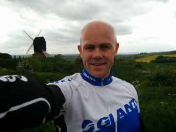

Dr Michael Salter-Townshend completed a postdoc investigating admixture events between human populations. He is now an Assistant Professor of Statistics at University College Dublin.

## [Dr Anna Frangou](https://uk.linkedin.com/in/anna-frangou-a2b03b65)

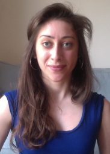

Dr Anna Frangou completed a DPhil on the the topic of ["Using genealogical trees to examine admixture between modern humans and Neandertals"](https://ora.ox.ac.uk/objects/uuid:ca235cb7-4d90-41d6-ad3d-0883567783a1). She is now a Postdoctoral Bioinformatician in cancer genomics at the Big Data Institute in Oxford.

## [Dr Nick Altemose](http://streetslab.berkeley.edu/people/nicolas-altemose/)

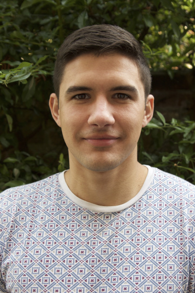

Dr Nick Altemose completed a DPhil on the topic of ["Novel genetic and molecular properties of meiotic recombination protein PRDM9"](http://solo.bodleian.ox.ac.uk/OXVU1:LSCOP_OX:oxfaleph020646080). He is now pursuing a second PhD, in Bioengineering, at UC Berkeley.

## [Prof. Robert Davies](https://twitter.com/robbie_stats)

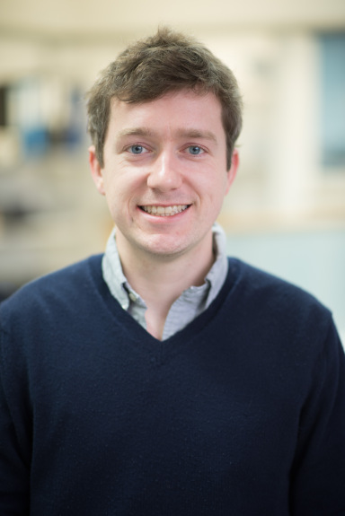

Prof. Robert Davies completed a DPhil as part of the Genomic Medicine and Statistics programme on the topic of ["Factors influencing genetic variation in wild mice"](https://ora.ox.ac.uk/objects/uuid:ced6a42f-66f5-4001-aaf8-8059d5fcfe27) (2011-2015). He is now an Associate Professor at the Department of Statistics in Oxford.

## Thaddeus Aid

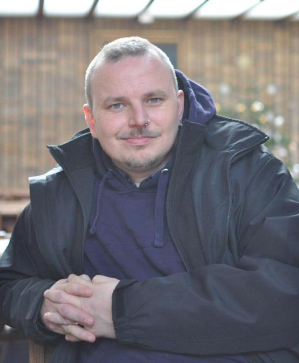

Thaddeus Aid completed an MPhil working on identifying evidence of human mutations influenced by natural selection by building genealogical trees genome-wide for a set of groups sequenced as part of the 1000 Genomes Project. He is now a Senior Site Reliability Engineer at LinkedIn.

## [Dr Marie Forest](https://ca.linkedin.com/in/marie-forest-73a94986)

Dr Marie Forest completed a DPhil on the topic of “Simultaneous estimation of population size changes and splits times using importance sampling” [ORA Link](https://ora.ox.ac.uk/objects/uuid:8c067a3d-44d5-468a-beb5-34c5830998c4) (2011-2014). She is now a Senior Lecturer at École de Technologie Supérieure in Montreal.

## [Dr Afidalina Tumian](https://twitter.com/drafidalina)

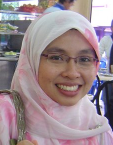

Dr Afidalina Tumian completed a DPhil on the topic of [“The Evolution of Recombination Hotspots and Their Relationship with DNA Sequences”](http://solo.bodleian.ox.ac.uk/OXVU1:LSCOP_OX:oxfaleph020406020) (2008-2012). She is now a Data Scientist at Petronas Research.

## [Dr Nudrat Noor](http://projects.iq.harvard.edu/james-toddlab/people/nudrat-noor-ms-phd)

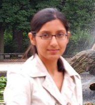

Dr Nudrat Noor completed a DPhil as part of the Genomic Medicine and Statistics programme on the topic of [“Molecular Mechanisms of Recombination Hotspots in Humans”](https://ora.ox.ac.uk/objects/uuid:dd26a44a-e190-42e3-b90f-d00269f8a7b4) (2010-2013). She is now a Senior Data Scientist at T1D Exchange.

## [Dr Anjali Gupta Hinch](https://www.well.ox.ac.uk/people/anjali)

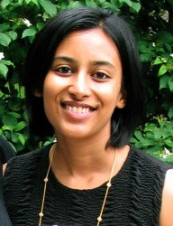

Dr Anjali Gupta Hinch completed a DPhil as part of the Genomic Medicine and Statistics programme on the topic of [“The landscape of recombination in African Americans : leveraging human population variation to investigate homologous recombination”](http://solo.bodleian.ox.ac.uk/OXVU1:LSCOP_OX:oxfaleph020397818) (2010-2013). She is now a postdoc in Prof. Peter Donnelly's group in Oxford.
