## Prof. Simon R. Myers
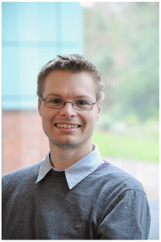
Our group is based jointly at the [Department of Statistics](https://www.stats.ox.ac.uk), and the [Wellcome Trust Centre for Human Genetics](https://www.well.ox.ac.uk). We are broadly interested in answering questions in statistical, population, and medical genetics. We develop and apply model-based computational techniques, and perform lab-based research. One strong focus of the group’s research is the study of the basic biological process of recombination, and its links to fertility and health in mammals. A second focus is inference of  fine-scale population structure – within individual countries – and the genetic impacts of migration events, in humans and other species.

[CV](http://www.stats.ox.ac.uk/~myers/CV.docx) - 
[ORCID Profile](http://orcid.org/0000-0002-2585-9626) - 
[myers@stats.ox.ac.uk](mailto:myers@stats.ox.ac.uk)

### Dr Ipsita Agarwal 
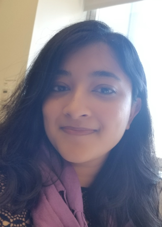
I am a postdoc at the Department of Statistics, working on building models for how DNA sequence modulates and is shaped by recombination events, using chromatin accessibility and expression data from single cells undergoing meiosis. I am broadly interested in using population genetics and computational approaches to understand the biology of the processes that underlie evolution. I received my Ph.D at Columbia University, where I worked on elucidating the causes and fitness consequences of de novo mutations in humans.

### [Lino Ferreira](https://lfe.pt)
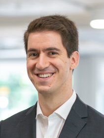
I completed my DPhil in Genomic Medicine and Statistics under Simon Myers' supervision in 2023 and currently work as a postdoctoral researcher in the group. My research focuses on genetic interactions and how these can help us to better understand the genetic basis of complex traits. Prior to starting my DPhil, I completed an MSc in statistics at the University of Edinburgh.

### Dr Martin Houlard
I am a senior postdoctoral researcher at the Centre for Human Genetics.

### Nikolas Baya
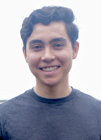
I am a DPhil student co-supervised by Prof. Simon Myers and Prof. Cecilia Lindgren as part of the Genomic Medicine and Statistics programme. In my research I study the genetic architecture of extreme and unexpected phenotypes. I received an undergraduate degree in applied mathematics at Brown University and worked at the Broad Institute of MIT and Harvard before coming to Oxford.

### Yunong Lin
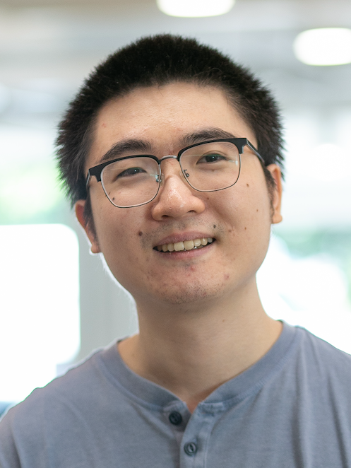
I am a DPhil student co-supervised by Prof. Simon Myers and Prof. Robert Davies. I am currently working on the GWAS associations of stratified cohorts. I did my MSc in statistics at University of Wisconsin-Madison, and worked as a research specialist there for a year after my graduation.

### Hrushikesh Loya

I am a DPhil student in Genomic Medicine and Statistics jointly co-supervised by Prof. Simon Myers and Prof. Pier Palamara. My primary research interest involves Bayesian method development for application in statistical and population genetics. Before Oxford, I completed my bachelor's and masters in electrical engineering from IIT Bombay, India. 

### Brynelle Myers
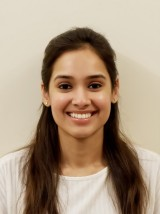
I am a lab-based experimental researcher in Simon Myers’ team since September 2021. I am currently working on mammalian meiosis, including epigenetic regulation of gene expression using single-cell technologies. I obtained my MPhil degree at Newcastle University prior to working at the University of Cambridge (2017–2019) and Wellcome Sanger Institute (2019–2021).

 

## Alumni

### Post-doctoral researchers

### [Dr Anastasia Ignatieva](https://www.stats.ox.ac.uk/~ignatiev/index.html)
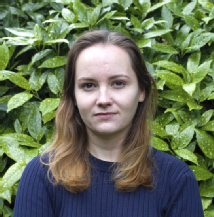
Ana worked on developing scalable methods for understanding aspects of human evolution. She is now a Lecturer at the School of Mathematics & Statistics, University of Glasgow.

#### Dr Emmanuelle Bitoun
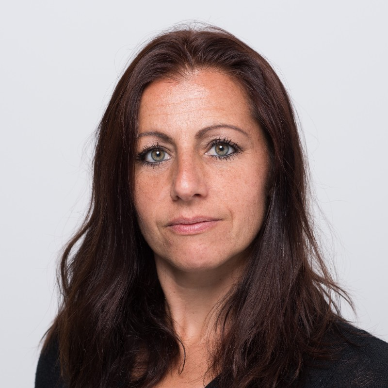
Emmanuelle worked in our group for eight years, performing experimental lab-based research to study recombination, and its links to speciation, in mammals. She is now Principal Scientist at Ochre Bio.

#### [Dr Leo Speidel](https://leospeidel.com/)
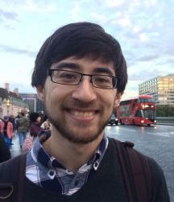
Leo completed a DPhil ([link to thesis](https://ora.ox.ac.uk/objects/uuid:61e3f8d0-6911-461d-92ea-ee91559cf353)) and postdoc (2016–2020) working on a method for estimating genealogies for thousands of DNA samples. The method, Relate, is available at [https://myersgroup.github.io/relate/](https://myersgroup.github.io/relate/). He is now a Sir Henry Wellcome fellow at the UCL Genetics Institute and the Francis Crick Institute in London.

#### [Dr Sile Hu](http://users.ox.ac.uk/~stat0311/)
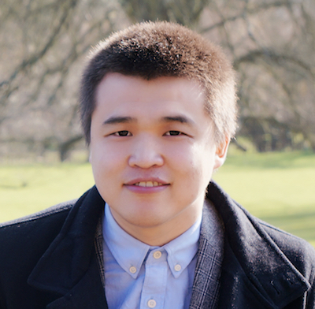
Sile completed a postdoc working on the project _Building a platform for genetic inference from the Genomics England data_. He is now a Research Scientist at the Novo Nordisk Research Centre in Oxford.

#### [Dr Ran Li](https://www.stats.ox.ac.uk/people/research_staff/ran_li)

Ran completed a postdoc working on the resolution of recombination. She is now a Postdoctoral Researcher in the Peter Ratcliffe Group in Oxford.

#### Previous post-doctoral alumni

- [Dr Zhangyi He](https://uk.linkedin.com/in/zhangyi-he), Postdoctoral researcher (2016–2018)

- [Dr Michael Salter-Townshend](https://maths.ucd.ie/~mst/), Postdoctoral researcher (2009–2013)

 

### Research students

#### Dr Sinan Shi
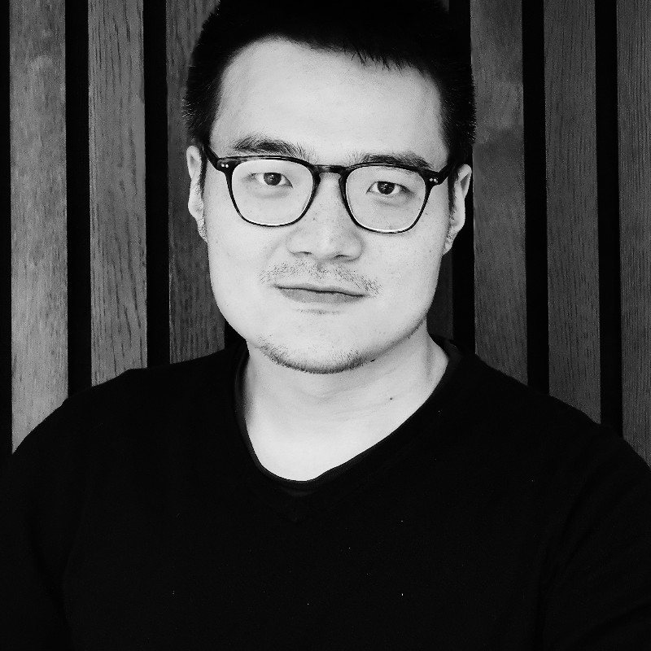
Sinan completed a DPhil (2018–2023) under the co-supervision of Pier Palamara and Simon. He worked on the phasing and imputation of the 100,000 Genomes Project of Genomics England. Sinan is now a Postdoctoral Research Assistant in Pier Palamara's group.

#### Dr Miriam Stricker
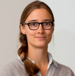
Miriam completed a DPhil (2018–2023) under the co-supervision of Pier Palamara and Simon. She developed machine learning algorithms to study how variation in non-coding parts of the genome influences the epigenetics and expression levels of coding parts of the genome.

#### Dr Luis Torada Aguilella
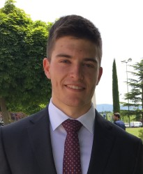
Luis completed a DPhil (2018–2023) under the co-supervision of Robert Davies and Simon at Oxford, as well as Satu Nahkuri and Tony Kam-Thong at Roche. His work focused on investigating genetic heterogeneity within Autism Spectrum Disorder.

#### Dr Christopher C. Gill
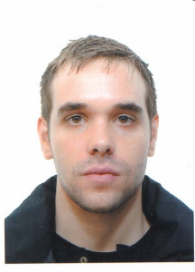
Chris completed a DPhil (2015–2021) on new methods in single-cell genomics which involve leveraging genomic annotations to uncover latent components in gene expression analysis ([link to thesis](https://ora.ox.ac.uk/objects/uuid:d267352b-a858-4bab-a853-e563d3f6dac9)).

#### [Dr Daniel Wells](http://www.danielwells.me)
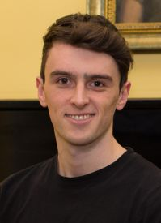
Daniel completed a DPhil (2015–2019) investigating patterns of gene expression in meiosis ([link to thesis](https://ora.ox.ac.uk/objects/uuid:8c1f75a8-ecc3-4ffe-b01f-d2e92c75e66c)). He is now a Precision Health Scientist at Genomics plc.

#### [Dr Clare Bycroft](https://www.linkedin.com/in/clare-bycroft-47bb0224/)
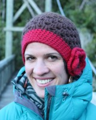
Clare completed a DPhil (2013–2017) on the inference of demographic history from patterns of genetic variation ([link to thesis](https://ora.ox.ac.uk/objects/uuid:c8a76d94-ded6-4a16-b5af-09bbad6292a2)). She is now a Scientist at Genomics plc.

#### Previous student alumni

- Jessica Cho, Undergraduate student in lab placement (2021–2022).

- [Dr Anna Frangou](https://www.bdi.ox.ac.uk/Team/anna-frangou), DPhil student (2011–2016). Thesis: [_Using genealogical trees to examine admixture between modern humans and Neandertals_](https://ora.ox.ac.uk/objects/uuid:ca235cb7-4d90-41d6-ad3d-0883567783a1)

- [Prof. Robert Davies](https://www.stats.ox.ac.uk/all-people/professor-robert-davies/), DPhil student (2011–2015). Thesis: [_Factors influencing genetic variation in wild mice_](https://ora.ox.ac.uk/objects/uuid:ced6a42f-66f5-4001-aaf8-8059d5fcfe27)

- [Dr Nick Altemose](http://streetslab.berkeley.edu/people/nicolas-altemose/), DPhil student (2011–2015). Thesis: [_Novel genetic and molecular properties of meiotic recombination protein PRDM9_](https://ora.ox.ac.uk/objects/uuid:1afe17c3-5f75-4166-8697-7da1471a5230))

- [Thaddeus Aid](https://www.linkedin.com/in/thaddeusaid/), Research student (2011–2015)

- [Dr Marie Forest](https://ca.linkedin.com/in/marie-forest-73a94986), DPhil student (2011–2014). Thesis: [_Simultaneous estimation of population size changes and splits times using importance sampling_](https://ora.ox.ac.uk/objects/uuid:8c067a3d-44d5-468a-beb5-34c5830998c4)

- [Dr Afidalina Tumian](https://www.linkedin.com/in/afidalina/), DPhil student (2008–2013). Thesis: [_The Evolution of Recombination Hotspots and Their Relationship with DNA Sequences_](http://solo.bodleian.ox.ac.uk/permalink/f/ds4uo7/oxfaleph020406020)

- [Dr Nudrat Noor](https://www.linkedin.com/in/nudrat-noor-b496b042/), DPhil student (2010–2013). Thesis: [_Molecular Mechanisms of Recombination Hotspots in Humans_](https://ora.ox.ac.uk/objects/uuid:dd26a44a-e190-42e3-b90f-d00269f8a7b4)

- [Dr Anjali Gupta Hinch](https://www.well.ox.ac.uk/people/anjali), DPhil student (2010–2013). Thesis: [_The landscape of recombination in African Americans: leveraging human population variation to investigate homologous recombination_](https://ora.ox.ac.uk/objects/uuid:585e2ad8-b6e7-458b-b547-fb955d17c561)

- Yunli Song, Research student
